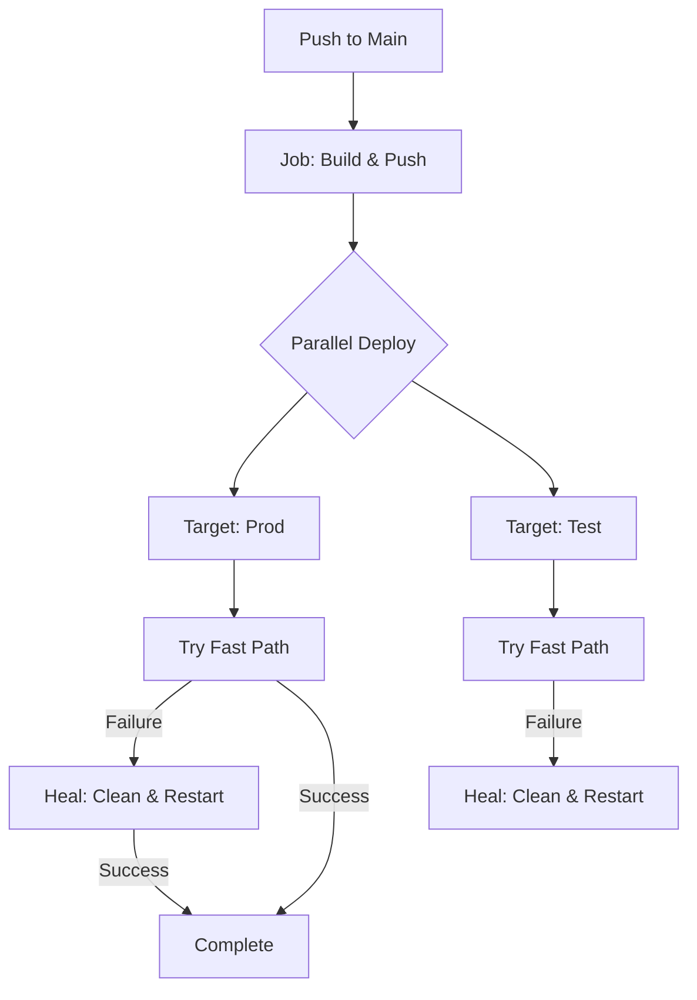

| Portal | URL | Description |
| :--- | :--- | :--- |
| **User Vitrine** | [Introduction](../guide/introduction.md) | The 2077 immersive site (User Doc) |
| **Neural Link** | `https://k-app.tech` | Production Demo |
| **Test Range** | `https://k-app.cloud` | High-Parity Test Server |
| **Identity Lab** | `auth.k-app.tech` | Central Auth Hub |

## Operational Guides
- [New Environment Setup](../guide/setup.md)
- [Backup & Recovery](../reference/backups.md)

## Deployment Pipeline

## Legacy Feature Tracking
| Feature | Status | Backup Strategy | Removal Date |
| :--- | :--- | :--- | :--- |
| File Persistence | Deprecated | `state_persistence.json` snapshot | TBD |
| Mock Auth | Removed | N/A | 2026-05-28 |: Mission Control (Meetings App)

## Authentication & Identity
The system uses **Keycloak** for real user management.
- **Identity Provider**: Keycloak running on port 8081.
- **Roles**:
  - `ORGANIZER` or `ADMIN`: Full command authority.
  - `PARTICIPANT`: Restricted self-assignment role.
  - `NONE` (Guest): Read-only access.
- **Interaction**:
  - Typing `login` redirects to the Keycloak SSO.
  - Typing `logout` clears the session.

## State Structure
The application state is managed as a flat object with nested `roles` and `members` logic.

### 1. Global Metadata
- `theme`: Current meeting theme.
- `date`, `location`, `room`: Logistics info.
- `registrationLink`, `mapUrl`, `zoomLink`: Connection uplinks.
- `wordOfTheDay`, `wordDefinition`: Meeting briefing nodes.

### 2. Roles Model (`state.roles`)
Managed via the `roles.` action prefix.
- `host` (Chair), `observer`, `speaker` (Table Topics): Lead roles.
- `timer` (Timekeeper), `scribe`, `reviewer`: Evaluative roles.
- `speakers`: Array of objects `{ id, name, title, evaluator }`.
  - Accessed via `roles.speaker.[field]` with an `{ id, val }` payload.

### 3. Member Registry (`state.members`)
Array of member objects:
- `id`: Unique string ID.
- `name`: Display name.
- `status`: `ONLINE`, `AWAY`, `SICK`, etc.
- `enrolled`: Array of Pathways `{ name, level, projects }`.

## UI Action Protocol
The `AiService.handleUiAction` is the gatekeeper for state transitions:
1.  **Flat Keys**: Direct update (`key: val`).
2.  **Role Keys**: Actions starting with `roles.` are parsed and merged into the `roles` sub-object.
3.  **Member Keys**: Actions like `editMember` or `deleteMember` perform array map/filter operations.

## Navigation Intent
The `MockAiService` resolves screen transitions:
- `members` / `registry` -> `currentScreen: 'members'`
- `workspace` / `back` -> `currentScreen: 'workspace'`
